# [📈 Live Status](https://upptime.github.io/upptime): <!--live status--> **🟧 Partial outage**

This repository contains the open-source uptime monitor and status page for [Upptime](https://upptime.js.org), powered by [Upptime](https://github.com/upptime/upptime).

With [Upptime](https://upptime.js.org), you can get your own unlimited and free uptime monitor and status page, powered entirely by a GitHub repository. We use [Issues](https://github.com/upptime/upptime/issues) as incident reports, [Actions](https://github.com/DHBern/upptime_demo/actions) as uptime monitors, and [Pages](https://upptime.github.io/upptime) for the status page.

<!--start: status pages-->
<!-- This summary is generated by Upptime (https://github.com/upptime/upptime) -->
<!-- Do not edit this manually, your changes will be overwritten -->
<!-- prettier-ignore -->
| URL | Status | History | Response Time | Uptime |
| --- | ------ | ------- | ------------- | ------ |
|  [Digital Editions - University of Bern](https://digitaleditions.ch/) | 🟩 Up | [digital-editions-university-of-bern.yml](https://github.com/DHBern/upptime_digitaleditions/commits/HEAD/history/digital-editions-university-of-bern.yml) | 

 423ms
     
 | 

<a href="https://status.digitaleditions.ch/history/digital-editions-university-of-bern">100.00%</a>
    

|  [Brandans Meerfahrt](https://brandans-meerfahrt.digitaleditions.ch/) | 🟩 Up | [brandans-meerfahrt.yml](https://github.com/DHBern/upptime_digitaleditions/commits/HEAD/history/brandans-meerfahrt.yml) | 

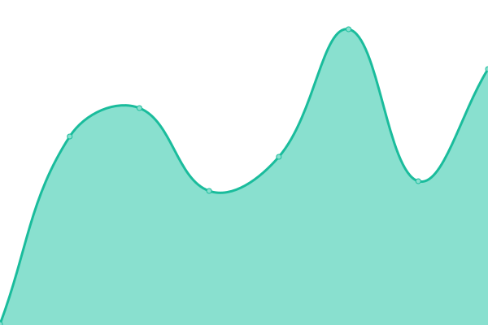 403ms
     
 | 

<a href="https://status.digitaleditions.ch/history/brandans-meerfahrt">100.00%</a>
    

|  [Re-use of editions and text collections](https://workshop.resed.digitaleditions.ch/) | 🟩 Up | [re-use-of-editions-and-text-collections.yml](https://github.com/DHBern/upptime_digitaleditions/commits/HEAD/history/re-use-of-editions-and-text-collections.yml) | 

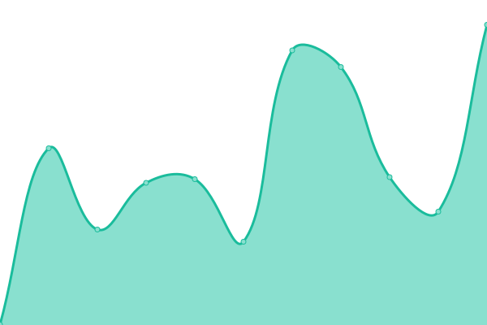 361ms
     
 | 

<a href="https://status.digitaleditions.ch/history/re-use-of-editions-and-text-collections">100.00%</a>
    

|  [Gossembrot Bibliothek](https://gossembrot.unibe.ch/gossembrot-portal/) | 🟩 Up | [gossembrot-bibliothek.yml](https://github.com/DHBern/upptime_digitaleditions/commits/HEAD/history/gossembrot-bibliothek.yml) | 

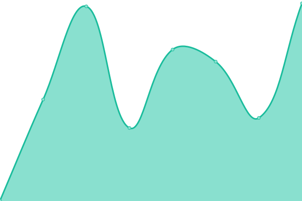 945ms
     
 | 

<a href="https://status.digitaleditions.ch/history/gossembrot-bibliothek">100.00%</a>
    

|  [Wellcome Schreiber (Redirect to wellcome-schreiber.unibe.ch)](https://wellcome-schreiber.digitaleditions.ch/) | 🟩 Up | [wellcome-schreiber-redirect-to-wellcome-schreiber-unibe-ch.yml](https://github.com/DHBern/upptime_digitaleditions/commits/HEAD/history/wellcome-schreiber-redirect-to-wellcome-schreiber-unibe-ch.yml) | 

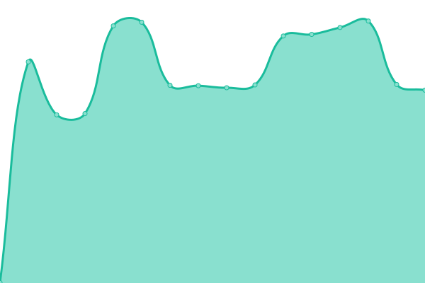 1001ms
     
 | 

<a href="https://status.digitaleditions.ch/history/wellcome-schreiber-redirect-to-wellcome-schreiber-unibe-ch">100.00%</a>
    

|  [Wellcome Schreiber](https://wellcome-schreiber.unibe.ch/) | 🟩 Up | [wellcome-schreiber.yml](https://github.com/DHBern/upptime_digitaleditions/commits/HEAD/history/wellcome-schreiber.yml) | 

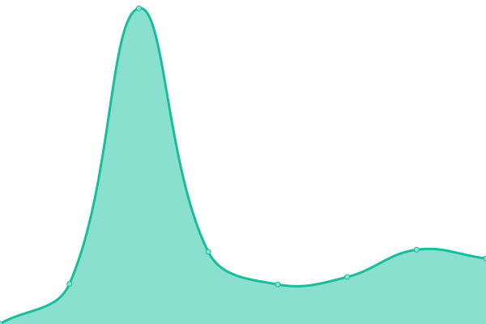 2ms
     
 | 

<a href="https://status.digitaleditions.ch/history/wellcome-schreiber">100.00%</a>
    

|  [Parzival-Projekt](https://parzival.unibe.ch/) | 🟩 Up | [parzival-projekt.yml](https://github.com/DHBern/upptime_digitaleditions/commits/HEAD/history/parzival-projekt.yml) | 

 824ms
     
 | 

<a href="https://status.digitaleditions.ch/history/parzival-projekt">100.00%</a>
    

|  [Parzival API](https://data.parzival.digitaleditions.ch/) | 🟩 Up | [parzival-api.yml](https://github.com/DHBern/upptime_digitaleditions/commits/HEAD/history/parzival-api.yml) | 

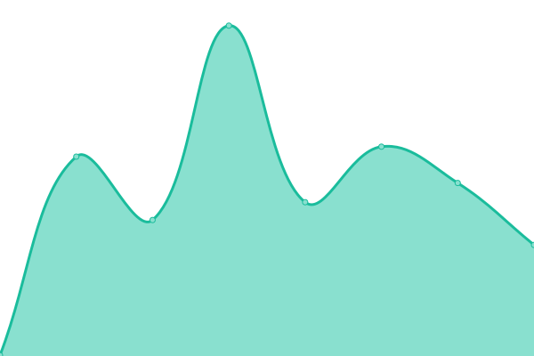 393ms
     
 | 

<a href="https://status.digitaleditions.ch/history/parzival-api">100.00%</a>
    

|  [Arcipelago Ceresa](https://arcipelago-ceresa.digitaleditions.ch/) | 🟩 Up | [arcipelago-ceresa.yml](https://github.com/DHBern/upptime_digitaleditions/commits/HEAD/history/arcipelago-ceresa.yml) | 

 330ms
     
 | 

<a href="https://status.digitaleditions.ch/history/arcipelago-ceresa">99.78%</a>
    

|  [Arcipelago Ceresa IIIF presentation API](https://iiif.arcipelago-ceresa.digitaleditions.ch/presentation/) | 🟩 Up | [arcipelago-ceresa-iiif-presentation-api.yml](https://github.com/DHBern/upptime_digitaleditions/commits/HEAD/history/arcipelago-ceresa-iiif-presentation-api.yml) | 

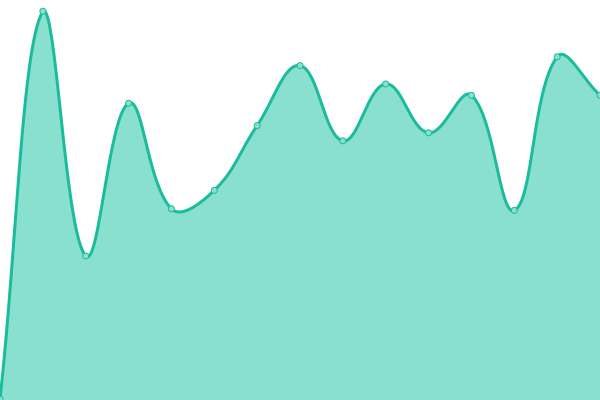 427ms
     
 | 

<a href="https://status.digitaleditions.ch/history/arcipelago-ceresa-iiif-presentation-api">100.00%</a>
    

|  [Annemarie Schwarzenbach. Digitale Edition der Kleinen Formen und Briefe](https://annemarie-schwarzenbach.ch/) | 🟩 Up | [annemarie-schwarzenbach-digitale-edition-der-kleinen-formen-und-briefe.yml](https://github.com/DHBern/upptime_digitaleditions/commits/HEAD/history/annemarie-schwarzenbach-digitale-edition-der-kleinen-formen-und-briefe.yml) | 

 487ms
     
 | 

<a href="https://status.digitaleditions.ch/history/annemarie-schwarzenbach-digitale-edition-der-kleinen-formen-und-briefe">100.00%</a>
    

|  [Annemarie Schwarzenbach DAV](https://dav.annemarie-schwarzenbach.ch/) | 🟩 Up | [annemarie-schwarzenbach-dav.yml](https://github.com/DHBern/upptime_digitaleditions/commits/HEAD/history/annemarie-schwarzenbach-dav.yml) | 

 772ms
     
 | 

<a href="https://status.digitaleditions.ch/history/annemarie-schwarzenbach-dav">100.00%</a>
    

|  [hallerNet (data)](https://data.hallernet.org/) | 🟥 Down | [haller-net-data.yml](https://github.com/DHBern/upptime_digitaleditions/commits/HEAD/history/haller-net-data.yml) | 

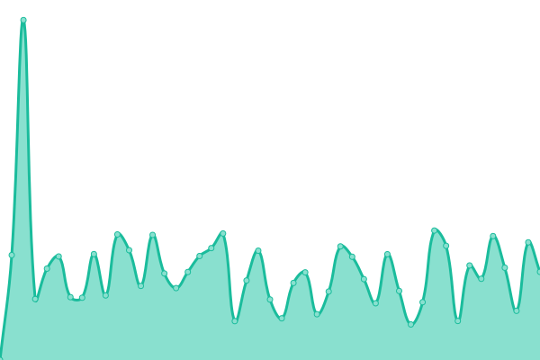 1410ms
     
 | 

<a href="https://status.digitaleditions.ch/history/haller-net-data">93.87%</a>
    

|  [hallernet.org (Redirect to "République des Lettres")](https://hallernet.org/) | 🟥 Down | [hallernet-org-redirect-to-republique-des-lettres.yml](https://github.com/DHBern/upptime_digitaleditions/commits/HEAD/history/hallernet-org-redirect-to-republique-des-lettres.yml) | 

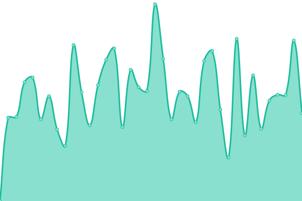 2429ms
     
 | 

<a href="https://status.digitaleditions.ch/history/hallernet-org-redirect-to-republique-des-lettres">93.91%</a>
    

|  [md.hallernet.org (Redirect to "République des Lettres (CodiMD)")](https://md.hallernet.org/) | 🟥 Down | [md-hallernet-org-redirect-to-republique-des-lettres-codi-md.yml](https://github.com/DHBern/upptime_digitaleditions/commits/HEAD/history/md-hallernet-org-redirect-to-republique-des-lettres-codi-md.yml) | 

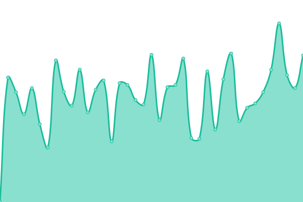 2350ms
     
 | 

<a href="https://status.digitaleditions.ch/history/md-hallernet-org-redirect-to-republique-des-lettres-codi-md">100.00%</a>
    

|  [République des Lettres (CodiMD)](https://md.republique-des-lettres.ch/) | 🟥 Down | [republique-des-lettres-codi-md.yml](https://github.com/DHBern/upptime_digitaleditions/commits/HEAD/history/republique-des-lettres-codi-md.yml) | 

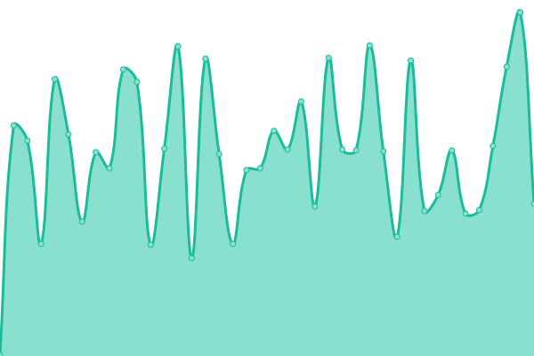 231ms
     
 | 

<a href="https://status.digitaleditions.ch/history/republique-des-lettres-codi-md">94.73%</a>
    

|  [République des Lettres - Daten- und Editionsplattform](https://republique-des-lettres.ch/) | 🟥 Down | [republique-des-lettres-daten-und-editionsplattform.yml](https://github.com/DHBern/upptime_digitaleditions/commits/HEAD/history/republique-des-lettres-daten-und-editionsplattform.yml) | 

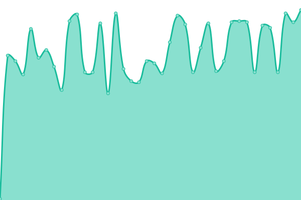 136ms
     
 | 

<a href="https://status.digitaleditions.ch/history/republique-des-lettres-daten-und-editionsplattform">94.83%</a>
    

<!--end: status pages-->

[**Visit our status website →**](https://upptime.github.io/upptime)

## 📄 License

- Powered by: [Upptime](https://github.com/upptime/upptime)
- Code: [MIT](./LICENSE) © [Anand Chowdhary](https://anandchowdhary.com), supported by [Pabio](https://pabio.com)
- Data in the `./history` directory: [Open Database License](https://opendatacommons.org/licenses/odbl/1-0/)
