# [📈 Live Status](https://upptime.github.io/upptime): <!--live status--> **🟩 All systems operational**

This repository contains the open-source uptime monitor and status page for [Upptime](https://upptime.js.org), powered by [Upptime](https://github.com/upptime/upptime).

With [Upptime](https://upptime.js.org), you can get your own unlimited and free uptime monitor and status page, powered entirely by a GitHub repository. We use [Issues](https://github.com/upptime/upptime/issues) as incident reports, [Actions](https://github.com/DHBern/upptime_demo/actions) as uptime monitors, and [Pages](https://upptime.github.io/upptime) for the status page.

<!--start: status pages-->
<!-- This summary is generated by Upptime (https://github.com/upptime/upptime) -->
<!-- Do not edit this manually, your changes will be overwritten -->
<!-- prettier-ignore -->
| URL | Status | History | Response Time | Uptime |
| --- | ------ | ------- | ------------- | ------ |
|  [Annemarie Schwarzenbach. Digitale Edition der Kleinen Formen und Briefe](https://annemarie-schwarzenbach.ch/) | 🟩 Up | [annemarie-schwarzenbach-digitale-edition-der-kleinen-formen-und-briefe.yml](https://github.com/DHBern/upptime_digitaleditions/commits/HEAD/history/annemarie-schwarzenbach-digitale-edition-der-kleinen-formen-und-briefe.yml) | 

 364ms
     
 | 

<a href="https://status.digitaleditions.ch/history/annemarie-schwarzenbach-digitale-edition-der-kleinen-formen-und-briefe">100.00%</a>
    

|  [Annemarie Schwarzenbach DAV](https://dav.annemarie-schwarzenbach.ch/) | 🟩 Up | [annemarie-schwarzenbach-dav.yml](https://github.com/DHBern/upptime_digitaleditions/commits/HEAD/history/annemarie-schwarzenbach-dav.yml) | 

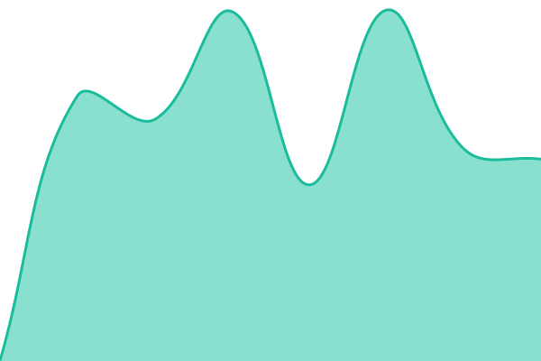 700ms
     
 | 

<a href="https://status.digitaleditions.ch/history/annemarie-schwarzenbach-dav">100.00%</a>
    

|  [Arcipelago Ceresa](https://arcipelago-ceresa.digitaleditions.ch/) | 🟩 Up | [arcipelago-ceresa.yml](https://github.com/DHBern/upptime_digitaleditions/commits/HEAD/history/arcipelago-ceresa.yml) | 

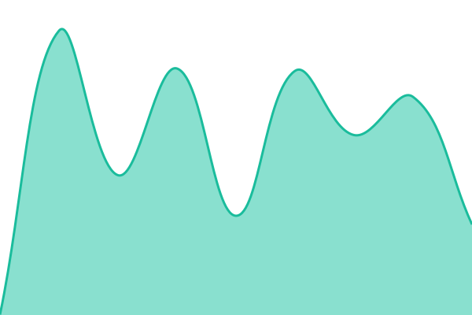 318ms
     
 | 

<a href="https://status.digitaleditions.ch/history/arcipelago-ceresa">100.00%</a>
    

|  [Arcipelago Ceresa IIIF presentation API](https://iiif.arcipelago-ceresa.digitaleditions.ch/presentation/) | 🟩 Up | [arcipelago-ceresa-iiif-presentation-api.yml](https://github.com/DHBern/upptime_digitaleditions/commits/HEAD/history/arcipelago-ceresa-iiif-presentation-api.yml) | 

 561ms
     
 | 

<a href="https://status.digitaleditions.ch/history/arcipelago-ceresa-iiif-presentation-api">100.00%</a>
    

|  [Brandans Meerfahrt](https://brandans-meerfahrt.digitaleditions.ch/) | 🟩 Up | [brandans-meerfahrt.yml](https://github.com/DHBern/upptime_digitaleditions/commits/HEAD/history/brandans-meerfahrt.yml) | 

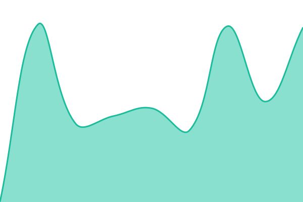 352ms
     
 | 

<a href="https://status.digitaleditions.ch/history/brandans-meerfahrt">100.00%</a>
    

|  [Digital Editions – University of Bern](https://digitaleditions.ch/) | 🟩 Up | [digital-editions-university-of-bern.yml](https://github.com/DHBern/upptime_digitaleditions/commits/HEAD/history/digital-editions-university-of-bern.yml) | 

 355ms
     
 | 

<a href="https://status.digitaleditions.ch/history/digital-editions-university-of-bern">100.00%</a>
    

|  [Gossembrot Bibliothek](https://gossembrot.unibe.ch/) | 🟩 Up | [gossembrot-bibliothek.yml](https://github.com/DHBern/upptime_digitaleditions/commits/HEAD/history/gossembrot-bibliothek.yml) | 

 282ms
     
 | 

<a href="https://status.digitaleditions.ch/history/gossembrot-bibliothek">100.00%</a>
    

|  [Gossembrot Bibliothek (Redirect to gossembrot.unibe.ch)](https://gossembrot.digitaleditions.ch/) | 🟩 Up | [gossembrot-bibliothek-redirect-to-gossembrot-unibe-ch.yml](https://github.com/DHBern/upptime_digitaleditions/commits/HEAD/history/gossembrot-bibliothek-redirect-to-gossembrot-unibe-ch.yml) | 

 691ms
     
 | 

<a href="https://status.digitaleditions.ch/history/gossembrot-bibliothek-redirect-to-gossembrot-unibe-ch">100.00%</a>
    

|  [Gossembrot Bibliothek (Redirect to gossembrot.unibe.ch)](https://www.gossembrot.digitaleditions.ch/) | 🟩 Up | [gossembrot-bibliothek-redirect-to-gossembrot-unibe-ch.yml](https://github.com/DHBern/upptime_digitaleditions/commits/HEAD/history/gossembrot-bibliothek-redirect-to-gossembrot-unibe-ch.yml) | 

 691ms
     
 | 

<a href="https://status.digitaleditions.ch/history/gossembrot-bibliothek-redirect-to-gossembrot-unibe-ch">100.00%</a>
    

|  [Gossembrot Bibliothek (Redirect to gossembrot.digitaleditions.ch)](https://www.gossembrot.unibe.ch/) | 🟩 Up | [gossembrot-bibliothek-redirect-to-gossembrot-digitaleditions-ch.yml](https://github.com/DHBern/upptime_digitaleditions/commits/HEAD/history/gossembrot-bibliothek-redirect-to-gossembrot-digitaleditions-ch.yml) | 

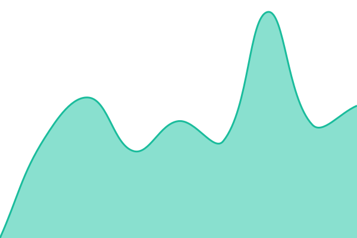 1512ms
     
 | 

<a href="https://status.digitaleditions.ch/history/gossembrot-bibliothek-redirect-to-gossembrot-digitaleditions-ch">100.00%</a>
    

|  [Parzival](https://parzival.unibe.ch/) | 🟩 Up | [parzival.yml](https://github.com/DHBern/upptime_digitaleditions/commits/HEAD/history/parzival.yml) | 

 278ms
     
 | 

<a href="https://status.digitaleditions.ch/history/parzival">100.00%</a>
    

|  [Parzival (Redirect to parzival.unibe.ch)](https://parzival.digitaleditions.ch/) | 🟩 Up | [parzival-redirect-to-parzival-unibe-ch.yml](https://github.com/DHBern/upptime_digitaleditions/commits/HEAD/history/parzival-redirect-to-parzival-unibe-ch.yml) | 

 675ms
     
 | 

<a href="https://status.digitaleditions.ch/history/parzival-redirect-to-parzival-unibe-ch">100.00%</a>
    

|  [Parzival (Redirect to parzival.unibe.ch)](https://www.parzival.digitaleditions.ch/) | 🟩 Up | [parzival-redirect-to-parzival-unibe-ch.yml](https://github.com/DHBern/upptime_digitaleditions/commits/HEAD/history/parzival-redirect-to-parzival-unibe-ch.yml) | 

 675ms
     
 | 

<a href="https://status.digitaleditions.ch/history/parzival-redirect-to-parzival-unibe-ch">100.00%</a>
    

|  [Parzival (Redirect to parzival.digitaleditions.ch)](https://www.parzival.unibe.ch/) | 🟩 Up | [parzival-redirect-to-parzival-digitaleditions-ch.yml](https://github.com/DHBern/upptime_digitaleditions/commits/HEAD/history/parzival-redirect-to-parzival-digitaleditions-ch.yml) | 

 1518ms
     
 | 

<a href="https://status.digitaleditions.ch/history/parzival-redirect-to-parzival-digitaleditions-ch">100.00%</a>
    

|  [Parzival legacy](https://parzdb.parzival.unibe.ch/) | 🟩 Up | [parzival-legacy.yml](https://github.com/DHBern/upptime_digitaleditions/commits/HEAD/history/parzival-legacy.yml) | 

 793ms
     
 | 

<a href="https://status.digitaleditions.ch/history/parzival-legacy">100.00%</a>
    

|  [Parzival legacy (Redirect to parzdb.parzival.unibe.ch)](https://www.parzdb.parzival.unibe.ch/) | 🟩 Up | [parzival-legacy-redirect-to-parzdb-parzival-unibe-ch.yml](https://github.com/DHBern/upptime_digitaleditions/commits/HEAD/history/parzival-legacy-redirect-to-parzdb-parzival-unibe-ch.yml) | 

 734ms
     
 | 

<a href="https://status.digitaleditions.ch/history/parzival-legacy-redirect-to-parzdb-parzival-unibe-ch">100.00%</a>
    

|  [Parzival API](https://data.parzival.digitaleditions.ch/) | 🟩 Up | [parzival-api.yml](https://github.com/DHBern/upptime_digitaleditions/commits/HEAD/history/parzival-api.yml) | 

 239ms
     
 | 

<a href="https://status.digitaleditions.ch/history/parzival-api">100.00%</a>
    

|  [Parzival – Rappoltstein](https://rappoltstein.parzival.unibe.ch/) | 🟩 Up | [parzival-rappoltstein.yml](https://github.com/DHBern/upptime_digitaleditions/commits/HEAD/history/parzival-rappoltstein.yml) | 

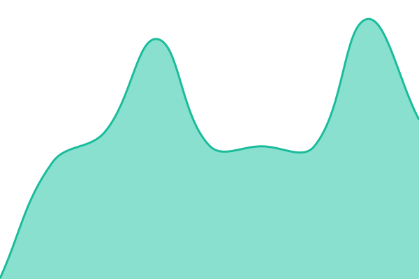 280ms
     
 | 

<a href="https://status.digitaleditions.ch/history/parzival-rappoltstein">100.00%</a>
    

|  [Parzival – Rappoltstein (Redirect to rappoltstein.parzival.unibe.ch)](https://rappoltstein.parzival.digitaleditions.ch/) | 🟩 Up | [parzival-rappoltstein-redirect-to-rappoltstein-parzival-unibe-ch.yml](https://github.com/DHBern/upptime_digitaleditions/commits/HEAD/history/parzival-rappoltstein-redirect-to-rappoltstein-parzival-unibe-ch.yml) | 

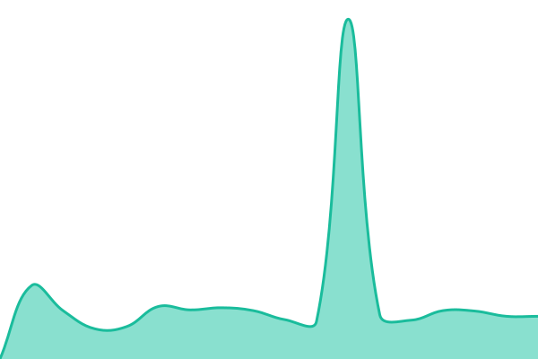 572ms
     
 | 

<a href="https://status.digitaleditions.ch/history/parzival-rappoltstein-redirect-to-rappoltstein-parzival-unibe-ch">100.00%</a>
    

|  [Parzival – Rappoltstein (Redirect to rappoltstein.parzival.unibe.ch)](https://www.rappoltstein.parzival.digitaleditions.ch/) | 🟩 Up | [parzival-rappoltstein-redirect-to-rappoltstein-parzival-unibe-ch.yml](https://github.com/DHBern/upptime_digitaleditions/commits/HEAD/history/parzival-rappoltstein-redirect-to-rappoltstein-parzival-unibe-ch.yml) | 

 572ms
     
 | 

<a href="https://status.digitaleditions.ch/history/parzival-rappoltstein-redirect-to-rappoltstein-parzival-unibe-ch">100.00%</a>
    

|  [Parzival – Rappoltstein (Redirect to rappoltstein.parzival.digitaleditions.ch)](https://www.rappoltstein.parzival.unibe.ch/) | 🟩 Up | [parzival-rappoltstein-redirect-to-rappoltstein-parzival-digitaleditions-ch.yml](https://github.com/DHBern/upptime_digitaleditions/commits/HEAD/history/parzival-rappoltstein-redirect-to-rappoltstein-parzival-digitaleditions-ch.yml) | 

 1968ms
     
 | 

<a href="https://status.digitaleditions.ch/history/parzival-rappoltstein-redirect-to-rappoltstein-parzival-digitaleditions-ch">100.00%</a>
    

|  [Parzival – Cgm 19](https://cgm19.parzival.unibe.ch/) | 🟩 Up | [parzival-cgm-19.yml](https://github.com/DHBern/upptime_digitaleditions/commits/HEAD/history/parzival-cgm-19.yml) | 

 192ms
     
 | 

<a href="https://status.digitaleditions.ch/history/parzival-cgm-19">100.00%</a>
    

|  [Parzival – Cgm 19 (Redirect to cgm19.parzival.unibe.ch)](https://cgm19.parzival.digitaleditions.ch/) | 🟩 Up | [parzival-cgm-19-redirect-to-cgm19-parzival-unibe-ch.yml](https://github.com/DHBern/upptime_digitaleditions/commits/HEAD/history/parzival-cgm-19-redirect-to-cgm19-parzival-unibe-ch.yml) | 

 588ms
     
 | 

<a href="https://status.digitaleditions.ch/history/parzival-cgm-19-redirect-to-cgm19-parzival-unibe-ch">100.00%</a>
    

|  [Parzival – Cgm 19 (Redirect to cgm19.parzival.unibe.ch)](https://www.cgm19.parzival.digitaleditions.ch/) | 🟩 Up | [parzival-cgm-19-redirect-to-cgm19-parzival-unibe-ch.yml](https://github.com/DHBern/upptime_digitaleditions/commits/HEAD/history/parzival-cgm-19-redirect-to-cgm19-parzival-unibe-ch.yml) | 

 588ms
     
 | 

<a href="https://status.digitaleditions.ch/history/parzival-cgm-19-redirect-to-cgm19-parzival-unibe-ch">100.00%</a>
    

|  [Parzival – Cgm 19 (Redirect to cgm19.parzival.digitaleditions.ch)](https://www.cgm19.parzival.unibe.ch/) | 🟩 Up | [parzival-cgm-19-redirect-to-cgm19-parzival-digitaleditions-ch.yml](https://github.com/DHBern/upptime_digitaleditions/commits/HEAD/history/parzival-cgm-19-redirect-to-cgm19-parzival-digitaleditions-ch.yml) | 

 1292ms
     
 | 

<a href="https://status.digitaleditions.ch/history/parzival-cgm-19-redirect-to-cgm19-parzival-digitaleditions-ch">100.00%</a>
    

|  [Parzival – Cod AA91](https://codaa91.parzival.unibe.ch/) | 🟩 Up | [parzival-cod-aa-91.yml](https://github.com/DHBern/upptime_digitaleditions/commits/HEAD/history/parzival-cod-aa-91.yml) | 

 212ms
     
 | 

<a href="https://status.digitaleditions.ch/history/parzival-cod-aa-91">100.00%</a>
    

|  [Parzival – Cod AA91 (Redirect to codaa91.parzival.unibe.ch)](https://codaa91.parzival.digitaleditions.ch/) | 🟩 Up | [parzival-cod-aa-91-redirect-to-codaa91-parzival-unibe-ch.yml](https://github.com/DHBern/upptime_digitaleditions/commits/HEAD/history/parzival-cod-aa-91-redirect-to-codaa91-parzival-unibe-ch.yml) | 

 593ms
     
 | 

<a href="https://status.digitaleditions.ch/history/parzival-cod-aa-91-redirect-to-codaa91-parzival-unibe-ch">100.00%</a>
    

|  [Parzival – Cod AA91 (Redirect to codaa91.parzival.unibe.ch)](https://www.codaa91.parzival.digitaleditions.ch/) | 🟩 Up | [parzival-cod-aa-91-redirect-to-codaa91-parzival-unibe-ch.yml](https://github.com/DHBern/upptime_digitaleditions/commits/HEAD/history/parzival-cod-aa-91-redirect-to-codaa91-parzival-unibe-ch.yml) | 

 593ms
     
 | 

<a href="https://status.digitaleditions.ch/history/parzival-cod-aa-91-redirect-to-codaa91-parzival-unibe-ch">100.00%</a>
    

|  [Parzival – Cod AA91 (Redirect to codaa91.parzival.digitaleditions.ch)](https://www.codaa91.parzival.unibe.ch/) | 🟩 Up | [parzival-cod-aa-91-redirect-to-codaa91-parzival-digitaleditions-ch.yml](https://github.com/DHBern/upptime_digitaleditions/commits/HEAD/history/parzival-cod-aa-91-redirect-to-codaa91-parzival-digitaleditions-ch.yml) | 

 1314ms
     
 | 

<a href="https://status.digitaleditions.ch/history/parzival-cod-aa-91-redirect-to-codaa91-parzival-digitaleditions-ch">100.00%</a>
    

|  [Parzival – Cod 857](https://cod857.parzival.unibe.ch/) | 🟩 Up | [parzival-cod-857.yml](https://github.com/DHBern/upptime_digitaleditions/commits/HEAD/history/parzival-cod-857.yml) | 

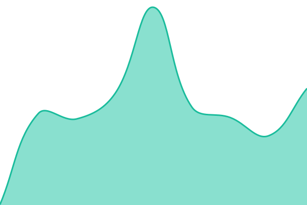 220ms
     
 | 

<a href="https://status.digitaleditions.ch/history/parzival-cod-857">100.00%</a>
    

|  [Parzival – Cod 857 (Redirect to cod857.parzival.unibe.ch)](https://cod857.parzival.digitaleditions.ch/) | 🟩 Up | [parzival-cod-857-redirect-to-cod857-parzival-unibe-ch.yml](https://github.com/DHBern/upptime_digitaleditions/commits/HEAD/history/parzival-cod-857-redirect-to-cod857-parzival-unibe-ch.yml) | 

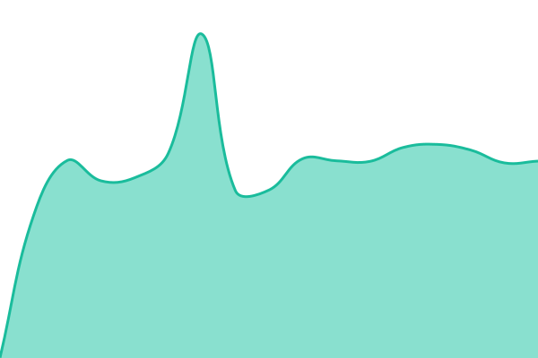 559ms
     
 | 

<a href="https://status.digitaleditions.ch/history/parzival-cod-857-redirect-to-cod857-parzival-unibe-ch">100.00%</a>
    

|  [Parzival – Cod 857 (Redirect to cod857.parzival.unibe.ch)](https://www.cod857.parzival.digitaleditions.ch/) | 🟩 Up | [parzival-cod-857-redirect-to-cod857-parzival-unibe-ch.yml](https://github.com/DHBern/upptime_digitaleditions/commits/HEAD/history/parzival-cod-857-redirect-to-cod857-parzival-unibe-ch.yml) | 

 559ms
     
 | 

<a href="https://status.digitaleditions.ch/history/parzival-cod-857-redirect-to-cod857-parzival-unibe-ch">100.00%</a>
    

|  [Parzival – Cod 857 (Redirect to cod857.parzival.digitaleditions.ch)](https://www.cod857.parzival.unibe.ch/) | 🟩 Up | [parzival-cod-857-redirect-to-cod857-parzival-digitaleditions-ch.yml](https://github.com/DHBern/upptime_digitaleditions/commits/HEAD/history/parzival-cod-857-redirect-to-cod857-parzival-digitaleditions-ch.yml) | 

 1257ms
     
 | 

<a href="https://status.digitaleditions.ch/history/parzival-cod-857-redirect-to-cod857-parzival-digitaleditions-ch">100.00%</a>
    

|  [Parzival – Schwerin](https://schwerin.parzival.unibe.ch/) | 🟩 Up | [parzival-schwerin.yml](https://github.com/DHBern/upptime_digitaleditions/commits/HEAD/history/parzival-schwerin.yml) | 

 243ms
     
 | 

<a href="https://status.digitaleditions.ch/history/parzival-schwerin">100.00%</a>
    

|  [Parzival – Schwerin (Redirect to schwerin.parzival.unibe.ch)](https://schwerin.parzival.digitaleditions.ch/) | 🟩 Up | [parzival-schwerin-redirect-to-schwerin-parzival-unibe-ch.yml](https://github.com/DHBern/upptime_digitaleditions/commits/HEAD/history/parzival-schwerin-redirect-to-schwerin-parzival-unibe-ch.yml) | 

 523ms
     
 | 

<a href="https://status.digitaleditions.ch/history/parzival-schwerin-redirect-to-schwerin-parzival-unibe-ch">100.00%</a>
    

|  [Parzival – Schwerin (Redirect to schwerin.parzival.unibe.ch)](https://www.schwerin.parzival.digitaleditions.ch/) | 🟩 Up | [parzival-schwerin-redirect-to-schwerin-parzival-unibe-ch.yml](https://github.com/DHBern/upptime_digitaleditions/commits/HEAD/history/parzival-schwerin-redirect-to-schwerin-parzival-unibe-ch.yml) | 

 523ms
     
 | 

<a href="https://status.digitaleditions.ch/history/parzival-schwerin-redirect-to-schwerin-parzival-unibe-ch">100.00%</a>
    

|  [Parzival – Schwerin (Redirect to schwerin.parzival.digitaleditions.ch)](https://www.schwerin.parzival.unibe.ch/) | 🟩 Up | [parzival-schwerin-redirect-to-schwerin-parzival-digitaleditions-ch.yml](https://github.com/DHBern/upptime_digitaleditions/commits/HEAD/history/parzival-schwerin-redirect-to-schwerin-parzival-digitaleditions-ch.yml) | 

 1250ms
     
 | 

<a href="https://status.digitaleditions.ch/history/parzival-schwerin-redirect-to-schwerin-parzival-digitaleditions-ch">100.00%</a>
    

|  [Parzival – Zürcher Skriptorium](https://skriptoriumzh.parzival.unibe.ch/) | 🟩 Up | [parzival-zuercher-skriptorium.yml](https://github.com/DHBern/upptime_digitaleditions/commits/HEAD/history/parzival-zuercher-skriptorium.yml) | 

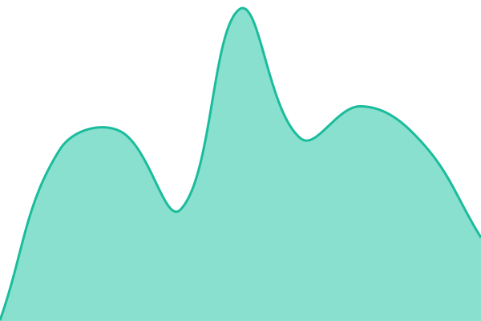 234ms
     
 | 

<a href="https://status.digitaleditions.ch/history/parzival-zuercher-skriptorium">100.00%</a>
    

|  [Parzival – Zürcher Skriptorium (Redirect to skriptoriumzh.parzival.unibe.ch)](https://skriptoriumzh.parzival.digitaleditions.ch/) | 🟩 Up | [parzival-zuercher-skriptorium-redirect-to-skriptoriumzh-parzival-unibe-ch.yml](https://github.com/DHBern/upptime_digitaleditions/commits/HEAD/history/parzival-zuercher-skriptorium-redirect-to-skriptoriumzh-parzival-unibe-ch.yml) | 

 542ms
     
 | 

<a href="https://status.digitaleditions.ch/history/parzival-zuercher-skriptorium-redirect-to-skriptoriumzh-parzival-unibe-ch">100.00%</a>
    

|  [Parzival – Zürcher Skriptorium (Redirect to skriptoriumzh.parzival.unibe.ch)](https://www.skriptoriumzh.parzival.digitaleditions.ch/) | 🟩 Up | [parzival-zuercher-skriptorium-redirect-to-skriptoriumzh-parzival-unibe-ch.yml](https://github.com/DHBern/upptime_digitaleditions/commits/HEAD/history/parzival-zuercher-skriptorium-redirect-to-skriptoriumzh-parzival-unibe-ch.yml) | 

 542ms
     
 | 

<a href="https://status.digitaleditions.ch/history/parzival-zuercher-skriptorium-redirect-to-skriptoriumzh-parzival-unibe-ch">100.00%</a>
    

|  [Parzival – Zürcher Skriptorium (Redirect to skriptoriumzh.parzival.digitaleditions.ch)](https://www.skriptoriumzh.parzival.unibe.ch/) | 🟩 Up | [parzival-zuercher-skriptorium-redirect-to-skriptoriumzh-parzival-digitaleditions-ch.yml](https://github.com/DHBern/upptime_digitaleditions/commits/HEAD/history/parzival-zuercher-skriptorium-redirect-to-skriptoriumzh-parzival-digitaleditions-ch.yml) | 

 1206ms
     
 | 

<a href="https://status.digitaleditions.ch/history/parzival-zuercher-skriptorium-redirect-to-skriptoriumzh-parzival-digitaleditions-ch">100.00%</a>
    

|  [RdL – hallerNet (data)](https://data.hallernet.org/) | 🟩 Up | [rd-l-haller-net-data.yml](https://github.com/DHBern/upptime_digitaleditions/commits/HEAD/history/rd-l-haller-net-data.yml) | 

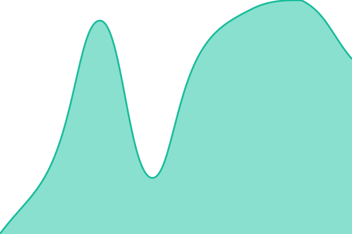 994ms
     
 | 

<a href="https://status.digitaleditions.ch/history/rd-l-haller-net-data">100.00%</a>
    

|  [RdL – hallernet.org (Redirect to "République des Lettres")](https://hallernet.org/) | 🟩 Up | [rd-l-hallernet-org-redirect-to-republique-des-lettres.yml](https://github.com/DHBern/upptime_digitaleditions/commits/HEAD/history/rd-l-hallernet-org-redirect-to-republique-des-lettres.yml) | 

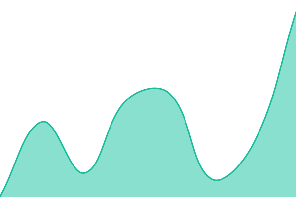 69ms
     
 | 

<a href="https://status.digitaleditions.ch/history/rd-l-hallernet-org-redirect-to-republique-des-lettres">100.00%</a>
    

|  [RdL – md.hallernet.org (Redirect to "République des Lettres (CodiMD)")](https://md.hallernet.org/) | 🟩 Up | [rd-l-md-hallernet-org-redirect-to-republique-des-lettres-codi-md.yml](https://github.com/DHBern/upptime_digitaleditions/commits/HEAD/history/rd-l-md-hallernet-org-redirect-to-republique-des-lettres-codi-md.yml) | 

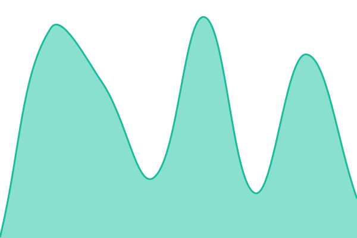 60ms
     
 | 

<a href="https://status.digitaleditions.ch/history/rd-l-md-hallernet-org-redirect-to-republique-des-lettres-codi-md">100.00%</a>
    

|  [RdL – République des Lettres (CodiMD)](https://md.republique-des-lettres.ch/) | 🟩 Up | [rd-l-republique-des-lettres-codi-md.yml](https://github.com/DHBern/upptime_digitaleditions/commits/HEAD/history/rd-l-republique-des-lettres-codi-md.yml) | 

 95ms
     
 | 

<a href="https://status.digitaleditions.ch/history/rd-l-republique-des-lettres-codi-md">100.00%</a>
    

|  [RdL – République des Lettres - Daten- und Editionsplattform](https://republique-des-lettres.ch/) | 🟩 Up | [rd-l-republique-des-lettres-daten-und-editionsplattform.yml](https://github.com/DHBern/upptime_digitaleditions/commits/HEAD/history/rd-l-republique-des-lettres-daten-und-editionsplattform.yml) | 

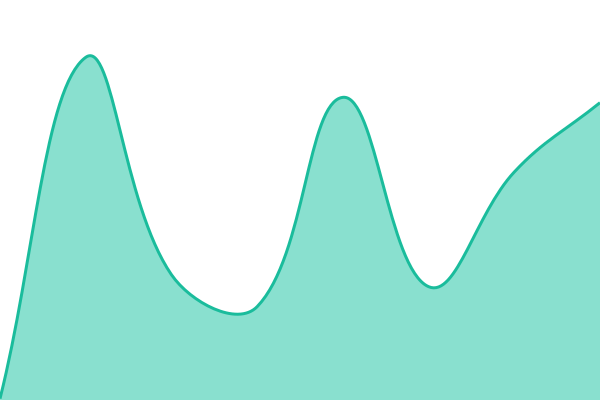 69ms
     
 | 

<a href="https://status.digitaleditions.ch/history/rd-l-republique-des-lettres-daten-und-editionsplattform">100.00%</a>
    

|  [ReSED – Re-use of editions and text collections](https://workshop.resed.digitaleditions.ch/) | 🟩 Up | [re-sed-re-use-of-editions-and-text-collections.yml](https://github.com/DHBern/upptime_digitaleditions/commits/HEAD/history/re-sed-re-use-of-editions-and-text-collections.yml) | 

 221ms
     
 | 

<a href="https://status.digitaleditions.ch/history/re-sed-re-use-of-editions-and-text-collections">100.00%</a>
    

|  [Wellcome Schreiber](https://wellcome-schreiber.unibe.ch/) | 🟩 Up | [wellcome-schreiber.yml](https://github.com/DHBern/upptime_digitaleditions/commits/HEAD/history/wellcome-schreiber.yml) | 

 219ms
     
 | 

<a href="https://status.digitaleditions.ch/history/wellcome-schreiber">100.00%</a>
    

|  [Wellcome Schreiber (Redirect to wellcome-schreiber.unibe.ch)](https://wellcome-schreiber.digitaleditions.ch/) | 🟩 Up | [wellcome-schreiber-redirect-to-wellcome-schreiber-unibe-ch.yml](https://github.com/DHBern/upptime_digitaleditions/commits/HEAD/history/wellcome-schreiber-redirect-to-wellcome-schreiber-unibe-ch.yml) | 

 521ms
     
 | 

<a href="https://status.digitaleditions.ch/history/wellcome-schreiber-redirect-to-wellcome-schreiber-unibe-ch">100.00%</a>
    

|  [Wellcome Schreiber (Redirect to wellcome-schreiber.unibe.ch)](https://www.wellcome-schreiber.digitaleditions.ch/) | 🟩 Up | [wellcome-schreiber-redirect-to-wellcome-schreiber-unibe-ch.yml](https://github.com/DHBern/upptime_digitaleditions/commits/HEAD/history/wellcome-schreiber-redirect-to-wellcome-schreiber-unibe-ch.yml) | 

 521ms
     
 | 

<a href="https://status.digitaleditions.ch/history/wellcome-schreiber-redirect-to-wellcome-schreiber-unibe-ch">100.00%</a>
    

|  [Wellcome Schreiber (Redirect to wellcome-schreiber.digitaleditions.ch)](https://www.wellcome-schreiber.unibe.ch/) | 🟩 Up | [wellcome-schreiber-redirect-to-wellcome-schreiber-digitaleditions-ch.yml](https://github.com/DHBern/upptime_digitaleditions/commits/HEAD/history/wellcome-schreiber-redirect-to-wellcome-schreiber-digitaleditions-ch.yml) | 

 1184ms
     
 | 

<a href="https://status.digitaleditions.ch/history/wellcome-schreiber-redirect-to-wellcome-schreiber-digitaleditions-ch">100.00%</a>
    

<!--end: status pages-->

[**Visit our status website →**](https://upptime.github.io/upptime)

## 📄 License

- Powered by: [Upptime](https://github.com/upptime/upptime)
- Code: [MIT](./LICENSE) © [Anand Chowdhary](https://anandchowdhary.com), supported by [Pabio](https://pabio.com)
- Data in the `./history` directory: [Open Database License](https://opendatacommons.org/licenses/odbl/1-0/)
